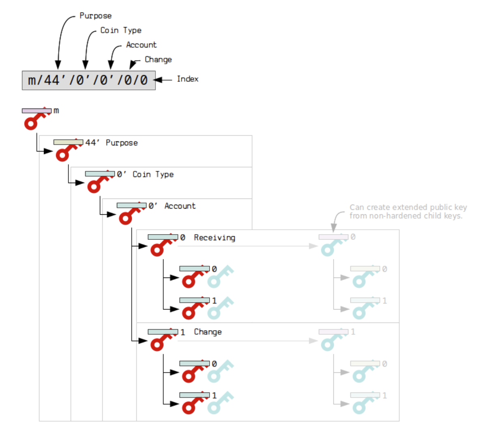

# From Mnemonic Phrase to Private Key
The `JS` script [`script.js`](https://github.com/pcaversaccio/mnemonic-to-private-key/blob/main/script.js) converts to the mnemonic phrase into a wallet private key using the [ethers.js](https://docs.ethers.io/v5/) library. First, create a `secrets.json` file that includes the mnemonic phrase. The file should look like the following (make sure to always [`.gitignore`](https://github.com/pcaversaccio/mnemonic-to-private-key/blob/main/.gitignore) it!):
```json
{
    "seedPhrase": "brain theme ..."
}
```
Then run `npm i` first and thereafter `node .\script.js`.

## Background on Deriving Path
We define the following 5 levels in [BIP32](https://github.com/bitcoin/bips/blob/master/bip-0032.mediawiki) path:
```
m / purpose' / coin_type' / account' / change / address_index
```
> `m = Master`

Each level has a special meaning, described in the chapters below. Apostrophe in the path indicates that [BIP32](https://github.com/bitcoin/bips/blob/master/bip-0032.mediawiki) hardened derivation is used. Generally, there are two posible types of [BIP32](https://github.com/bitcoin/bips/blob/master/bip-0032.mediawiki) derivation, *hardened* or *non-hardened*. In standard [BIP32](https://github.com/bitcoin/bips/blob/master/bip-0032.mediawiki) path notation, hardened derivation at a particular level is indicated by an apostrophe. For example, the following example of hardened derivation is used for the first three levels, while for the last two levels non-hardened derivation is used:
```
m / 44' / 0' / 1' / 1 / 33
```

With non-hardened keys, you can prove a child public key is linked to a parent public key using just the public keys. You can also derive public child keys from a public parent key, which enables watch-only wallets. With hardened child keys, you cannot prove that a child public key is linked to a parent public key.

### `purpose`
Purpose is a constant set to `44'` (or `0x8000002C`) following the [BIP43](https://github.com/bitcoin/bips/blob/master/bip-0043.mediawiki) recommendation. It indicates that the subtree of this node is used according to this specification.

Hardened derivation is used at this level.

### `coin_type`
One master node (seed) can be used for unlimited number of independent cryptocurrencies such as Bitcoin, Litecoin, or Ethereum. However, sharing the same space for various cryptocurrencies has some disadvantages.

This level creates a separate subtree for every cryptocurrency, avoiding reusing addresses across cryptocurrency and improving privacy issues.

`coin_type` is a constant, set for each cryptocurrency. Cryptocurrency developers may ask for registering unused number for their project.

Hardened derivation is used at this level.

### `account`
This level splits the key space into independent user identities, so the wallet never mixes the coins across different accounts.

Users can use these accounts to organize the funds in the same fashion as bank accounts; for donation purposes (where all addresses are considered public), for saving purposes, for common expenses etc.

Accounts are numbered from index 0 in sequentially increasing manner. This number is used as child index in BIP32 derivation.

Hardened derivation is used at this level.

Software should prevent a creation of an account if a previous account does not have a transaction history (meaning none of its addresses have been used before).

Software needs to discover all used accounts after importing the seed from an external source. Such an algorithm is described in "Account discovery" chapter.

### `change`
Constant 0 is used for external chain and constant 1 for internal chain (also known as change addresses). External chain is used for addresses that are meant to be visible outside of the wallet (e.g. for receiving payments). Internal chain is used for addresses which are not meant to be visible outside of the wallet and is used for return transaction change.

Public derivation is used at this level.

### `address_index`
Addresses are numbered from index 0 in sequentially increasing manner. This number is used as child index in BIP32 derivation.

Public derivation is used at this level.

### Visualisation


## References
[1] https://github.com/bitcoin/bips/blob/master/bip-0044.mediawiki#Purpose

[2] https://wiki.trezor.io/Hardened_and_non-hardened_derivation

[3] https://learnmeabitcoin.com/technical/derivation-paths
